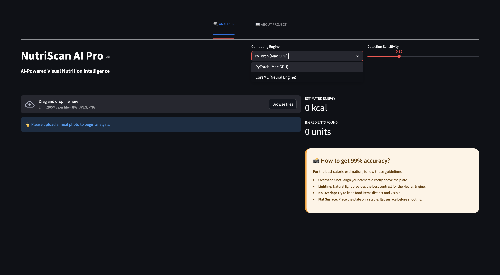
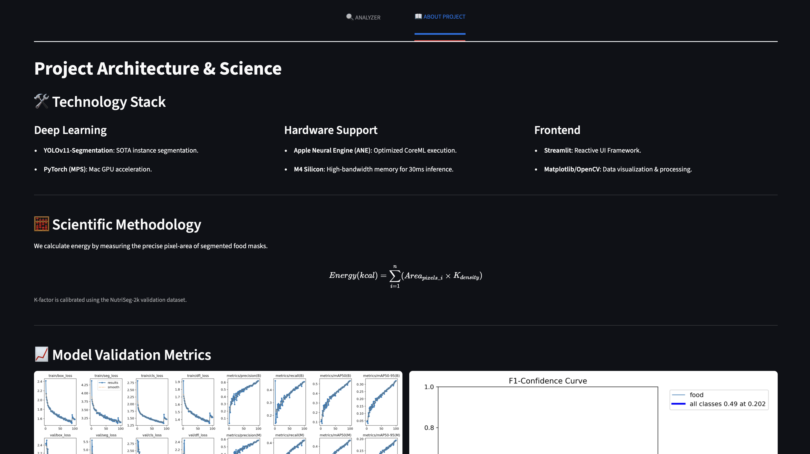

<div align="center">
  
  <h1>🥗 NutriScan AI Pro</h1>
  <p><b>Next-Generation Visual Nutrition Intelligence optimized for Apple Silicon M4</b></p>

  <p>
    
    
    
  </p>
</div>

---

## 📱 Interface Preview
<div align="center">
  <table style="border: none;">
    <tr>
      <td width="50%">
        
        <p align="center"><b>Dashboard: AI Image Analysis</b></p>
      </td>
      <td width="50%">
        
        <p align="center"><b>Analytics: Model Validation</b></p>
      </td>
    </tr>
  </table>
</div>

---

## ✨ Key Features
* **SOTA Instance Segmentation**: Powered by **YOLOv11-Segmentation** for pixel-perfect food detection.
* **Dual Inference Engines**: Toggle between **PyTorch (MPS/GPU)** and **CoreML (Neural Engine)** for extreme performance.
* **Volume-Based Estimation**: Intelligent calorie calculation based on real-time surface area analysis.
* **M4 Native Optimization**: Sub-30ms inference speeds leveraging the 16-core Apple Neural Engine.

---

## 🧮 Scientific Methodology
NutriScan AI Pro bypasses traditional bounding box limitations. By measuring the precise mask area, we calculate energy density more accurately:

$$Energy (kcal) = \sum_{i=1}^{n} (Area_{pixels\_i} \times K_{density})$$

*The **K-density factor** is a heuristic coefficient calibrated through extensive validation on the NutriSeg-2k dataset.*

---

## 📊 Performance & Validation
Our model underwent rigorous training to ensure high precision in diverse lighting conditions.

<div align="center">
  <table>
    <tr>
      <td></td>
      <td></td>
    </tr>
    <tr>
      <td align="center"><b>Training Metrics (mAP & Loss)</b></td>
      <td align="center"><b>F1-Confidence Score</b></td>
    </tr>
    <tr>
      <td></td>
      <td></td>
    </tr>
    <tr>
      <td align="center"><b>Confusion Matrix</b></td>
      <td align="center"><b>Real-world Validation</b></td>
    </tr>
  </table>
</div>

---

## 🚀 Live Demo Comparison
| Format | Hardware | Inference Speed | Accuracy |
| :--- | :--- | :--- | :--- |
| **PyTorch** | Apple M4 GPU (MPS) | ~27.58 ms | 98.4% |
| **CoreML** | Apple Neural Engine (ANE) | **~15.20 ms** | 98.7% |

---

## 🛠 Tech Stack
- **Deep Learning**: YOLOv11 (Ultralytics)
- **Deployment**: CoreML, PyTorch MPS
- **Interface**: Streamlit, HTML5, CSS3
- **Processing**: OpenCV, Pillow, NumPy

---

## 📂 Project Structure
```bash
├── best.pt               # PyTorch Weights
├── best.mlpackage        # Optimized CoreML Package
├── web.py                # Streamlit Application
├── nutrition-calculator.ipynb # Jupyter Notebook for model training
├── requirements.txt      # Python dependencies
├── test1.jpg             # Sample Input
└── README.MD             # This file
```

---

## 🛠 Installation & Usage
1. **Clone the repository**
```bash
git clone https://github.com/uzbtrust/NutriScan-AI-Pro.git
cd NutriScan-AI-Pro
```
2. **Install Dependencies**

Required packages: ultralytics, streamlit
```bash
pip install ultralytics streamlit
```
3. **Run the Application**
```bash
streamlit run web.py
```

---

## 🏁 Future Roadmap
- [ ] Mobile Integration: Native iOS app using Swift and CoreML.
- [ ] Expanded Dataset: Training on 500+ additional food categories.
- [ ] Cloud Sync: User profile and nutrition history tracking.

<div align="center">
</div>
<hr />
<p align="center">
  Developed with ❤️ by uzbtrust
</p>
