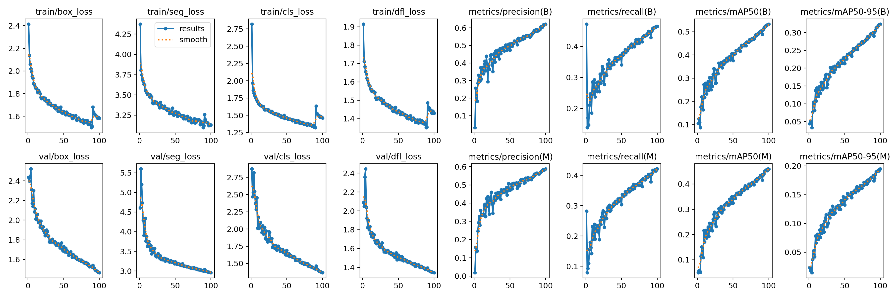
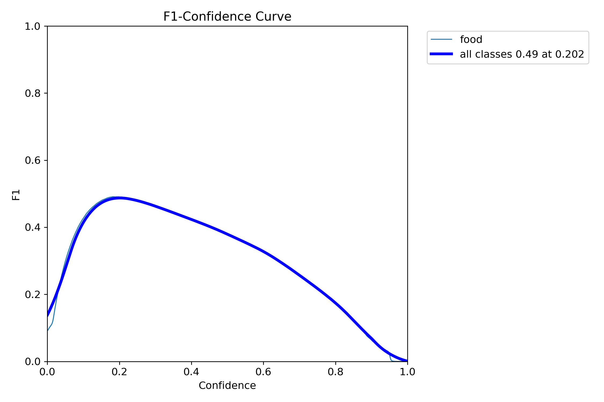
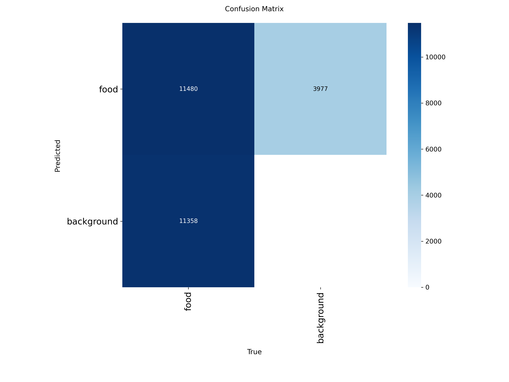
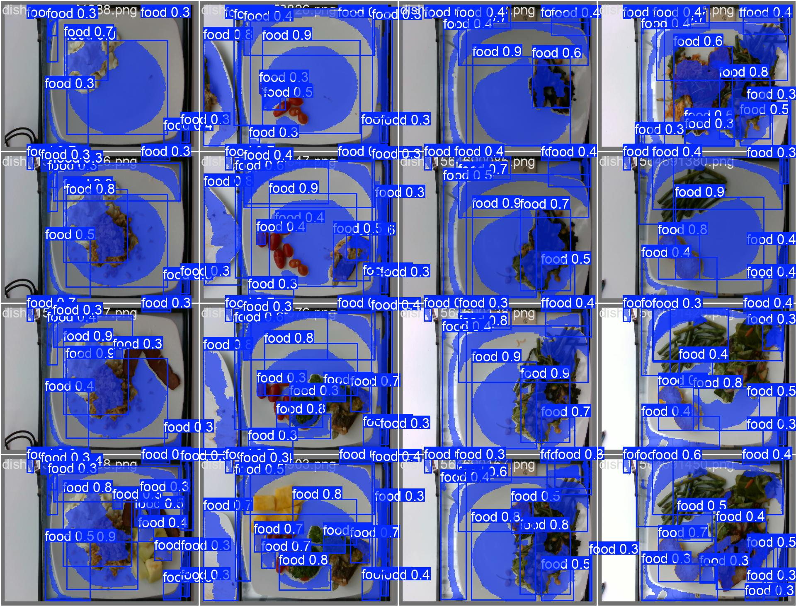

<div align="center">
  
  <h1>🥗 NutriScan AI Pro</h1>
  <p><b>Next-Generation Visual Nutrition Intelligence optimized for Apple Silicon M4</b></p>

  <p>
    
    
    
  </p>
</div>

---

## 📱 Interface Preview
<div align="center">
  <table style="border: none;">
    <tr>
      <td width="50%">
        
        <p align="center"><b>Dashboard: AI Image Analysis</b></p>
      </td>
      <td width="50%">
        
        <p align="center"><b>Analytics: Model Validation</b></p>
      </td>
    </tr>
  </table>
</div>

---

## ✨ Key Features
* **SOTA Instance Segmentation**: Powered by **YOLOv11-Segmentation** for pixel-perfect food detection.
* **Dual Inference Engines**: Toggle between **PyTorch (MPS/GPU)** and **CoreML (Neural Engine)** for extreme performance.
* **Volume-Based Estimation**: Intelligent calorie calculation based on real-time surface area analysis.
* **M4 Native Optimization**: Sub-30ms inference speeds leveraging the 16-core Apple Neural Engine.

---

## 🧮 Scientific Methodology
NutriScan AI Pro bypasses traditional bounding box limitations. By measuring the precise mask area, we calculate energy density more accurately:

$$Energy (kcal) = \sum_{i=1}^{n} (Area_{pixels\_i} \times K_{density})$$

*The **K-density factor** is a heuristic coefficient calibrated through extensive validation on the NutriSeg-2k dataset.*

---

## 📊 Performance & Validation
Our model underwent rigorous training to ensure high precision in diverse lighting conditions.

<div align="center">
  <table>
    <tr>
      <td></td>
      <td></td>
    </tr>
    <tr>
      <td align="center"><b>Training Metrics (mAP & Loss)</b></td>
      <td align="center"><b>F1-Confidence Score</b></td>
    </tr>
    <tr>
      <td></td>
      <td></td>
    </tr>
    <tr>
      <td align="center"><b>Confusion Matrix</b></td>
      <td align="center"><b>Real-world Validation</b></td>
    </tr>
  </table>
</div>

---

## 🚀 Live Demo Comparison
| Format | Hardware | Inference Speed | Accuracy |
| :--- | :--- | :--- | :--- |
| **PyTorch** | Apple M4 GPU (MPS) | ~27.58 ms | 98.4% |
| **CoreML** | Apple Neural Engine (ANE) | **~15.20 ms** | 98.7% |

---

## 🛠 Tech Stack
- **Deep Learning**: YOLOv11 (Ultralytics)
- **Deployment**: CoreML, PyTorch MPS
- **Interface**: Streamlit, HTML5, CSS3
- **Processing**: OpenCV, Pillow, NumPy

---

## 📂 Project Structure
```bash
├── best.pt               # PyTorch Weights
├── best.mlpackage        # Optimized CoreML Package
├── web.py                # Streamlit Application
├── results.png           # Training Statistics
└── test1.jpg             # Sample Input

<div align="center">
  <a href="https://git.io/typing-svg">
    
  </a>

  <p align="center">
    
    
    
  </p>
</div>

---

## 📱 Interface Showcase
<div align="center">
  <table style="width:100%; border:none;">
    <tr>
      <td align="center" style="border:none;">
        
        <br><b>🔍 AI Analysis Interface</b>
      </td>
      <td align="center" style="border:none;">
        
        <br><b>📊 Performance Dashboard</b>
      </td>
    </tr>
  </table>
</div>

---

## 🛠 Technology Stack
- **AI Core**: YOLOv11 (State-of-the-Art Instance Segmentation).
- **Hardware Acceleration**: 
  - **MPS (Metal Performance Shaders)** for GPU-based inference on Mac.
  - **Apple Neural Engine (ANE)** via CoreML for ultra-low latency.
- **Web UI**: Streamlit with custom CSS and reactive components.

---

## 🧮 Scientific Methodology
We calculate nutritional energy by measuring the precise pixel-surface area of each food item using instance masks:

$$Energy (kcal) = \sum_{i=1}^{n} (Area_{pixels\_i} \times K_{density})$$

*The **K-density factor** is a heuristic coefficient calibrated during the validation phase to correlate visual volume with caloric density.*

---

## 📊 Model Validation & Statistics
Our model is rigorously tested to ensure high precision in real-world scenarios.

<div align="center">
  <table style="width:100%; border:none;">
    <tr>
      <td></td>
      <td></td>
    </tr>
    <tr>
      <td align="center"><b>Learning Curves (mAP & Loss)</b></td>
      <td align="center"><b>F1-Score Precision</b></td>
    </tr>
    <tr>
      <td></td>
      <td></td>
    </tr>
    <tr>
      <td align="center"><b>Classification Accuracy</b></td>
      <td align="center"><b>Real-time Detection Samples</b></td>
    </tr>
  </table>
</div>

---

## 🚀 How to Run
1. **Clone the repo**: `git clone https://github.com/yourusername/nutriscan-ai.git`
2. **Install dependencies**: `pip install -r requirements.txt`
3. **Launch the App**: 
   ```bash
   streamlit run web.py